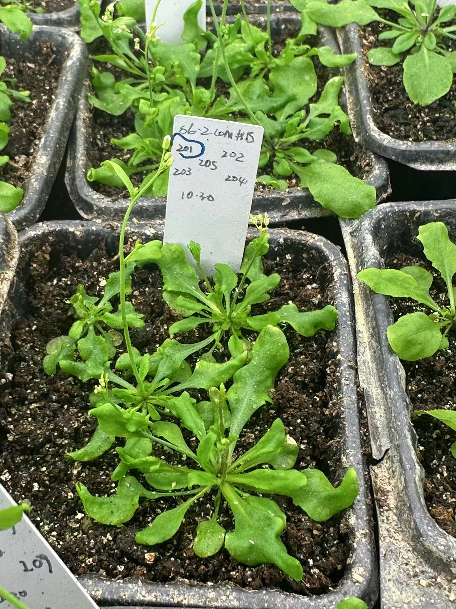
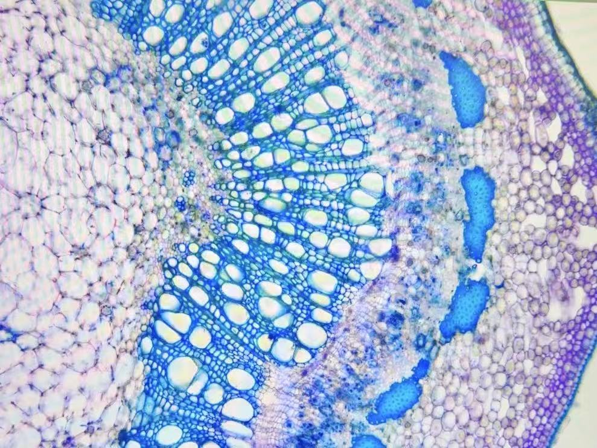

> **任务日志更新：在游荡..**
>
> 任务描述：请自由探索，说不定有什么好玩的呢？

---

### LOGIC [Medium: Failure]

你试图分析目前的处境。你看到自己的学生卡上写着“生物学在读”，这应该是你的**身份**。
但奇怪的是，你感觉鼠标正不受控制地滑向屏幕边缘。实验室的移液枪看起来像是一个低多边形的贴图，而那些“支线任务”看起来比较迷人。

**你：** “我想我迷路了。”

---

### SHIVERS (天人感应) [Easy: Success]

闭上眼睛。
你能感觉到它们。在培养箱的微光里，成千上万株拟南芥 (*Arabidopsis*) 正在呼吸。
它们在这个星球的表皮上静默地生长。无论你是否编辑和表达，它们都不会有次生生长。你需要寻找某种答案，但如果你再仔细听，你会听到一种声音。

那是一篇文章都没有发出去的寂静。
这种寂静震耳欲聋。

> **“妈妈，救命，我脖子上长了个头，而且我在里面。”**

    
    

---

### PHYSICAL INSTRUMENT (强身健体) [Hard: Failure]

*过高心率。*
你已经跑了很多年，健身房也去了很久，但此刻你可以感觉到神经正在退出肌肉。

**？：** “振作起来。”

**你：** “不。”

**？：** “那世界就会抛弃你，你会被落在后面。”

>“你父母给你的所有礼物，你朋友所有的爱和耐心，你都淹没在神经毒素里。你让痛苦赢了。它会一直赢下去，直到你死去——或者克服它。”

---

### INLAND EMPIRE (内陆帝国) [Legendary: Success]

来看看这里。
这才是真实的。你看到那个毛象的入口了吗？

>**“不。这是个可以待的地方。这就是你所拥有的一切，但它仍然是些东西。街道和钠灯。天空，世界。你还活着。”**

---

### ESPRIT DE CORPS (同舟共济) [Medium: Success]

谢谢你来。
