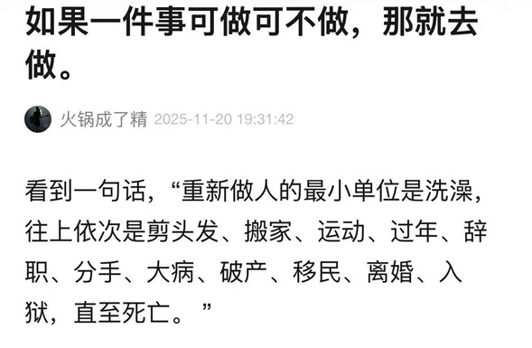
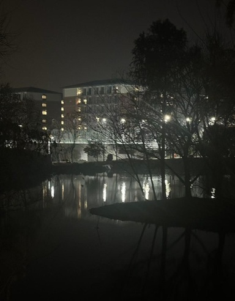
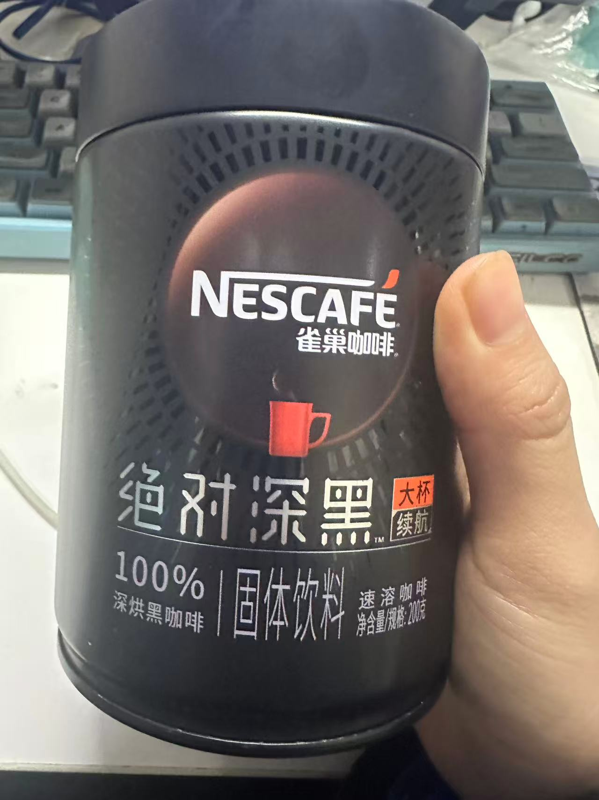

## 在开始前

*这是一个关于一次跑步和跑步时我在想什么碎碎念，我记录自己脑子里的碎片，一个念头冒出来不需要什么理由，并且可能彼此没有逻辑上的联系，而我跑步的一大乐趣就是让思维乱发散。你可以把它们当作不同的独立小故事。*

> **人或许就是各自过去的坍缩，记忆都是连在一起的，缺了一环就无法唤起现在一瞬间的感受。就像带鱼再怎么保鲜，在货架上也看不到它活着那种流动的银光闪闪的瞬态，除非你见过和记得。**

我已经两个月没有好好跑步了。近两周陷入一种奇怪的成长节点一样的停滞，当然这只是直觉。百思平吃完吃Eve，Eve吃完吃维B，再吞半勺氮泵，也挪不动。直到今晚，天气暖和得不像杭州，一个念头就出发。

## 去跑吧

路过水塘时风吹在脸上，会想起来在普吉夜跑。海边树林里隐约有年轻的笑声，宿舍楼下像是另一个海滨。

那天前任突然发微信，这几年总是春节前后这段时间找我，好像只要不再见面，我永远是他记忆里十七岁的影子。

我试图找回以前跑步的感觉。最近三年，跑步越来越关注数据：配速、平衡、心率精确到正负5。后来多一秒都不想跑。

---

记忆里唯一一次意外的轻松，是小学弟找我一起跑步。

过去三个月他和辛辛苦苦追到的模特姐姐在房间里抽了一地烟头。他学了便利店调酒，熟记各种买不起的香水品牌，摸清了七星蓝莓爆哪买。见面时他掏出一支我没抽过水果味电子烟递给我试试，说记得我不喜焦油味，他自己口袋里装着纸烟。

我不应该拿果味电子烟教坏小孩子的。

一边跑一边聊天。他说这次都想结婚了，但是姐姐比他大六岁，给了他一个断崖。现在练点薄肌，考个研，以后可以赘个好人家。

**操场大灯下他侧脸真的很像木村。**

那天全在聊天，反而一切数据都是一次完美的zone2。

---

跑过临界点后，那个时刻终于来了。不用管它叫“**心流**”还是“**有氧高潮**”。

首先，是视觉——从脚下的塑胶跑道，缓慢抬升到被照亮的树冠，然后越过远处的天际线。然后呼吸变深，四肢回暖，无数个过去的傍晚在此刻同时回来，天际线和天际线重叠，不知道现在空气的触感究竟是过去呆过的哪个地方。被包裹着，像在水面下往上看，灯光会随着呼吸闪烁，散光的话看到的会更漂亮。眼眶和鼻尖都会微微发热，四肢变得温暖。

不知道是不是其他人小时候也做过有关飞行的梦？悬浮在半空的时候，必须极小心维持某种姿势。不能太用力高兴自己有超能力，也不能刻意去想飞行的姿势，念头稍重一点，就会掉下来，然后用一种狼狈的姿势再尝试起飞。 

游泳、骑车、跑步，都能再复现一次飞行魔法。

> **飞行的秘密是感受到身处的介质，然后离开现在的地面。**

游泳时在水下，耳膜里塞满气泡的声音，水流沿额头向后滑去，依次舔舐脸颊、脖子、肩膀、划过脊柱和小腹、隔着皮肤贴紧股四和髂径束，一路向下滑去，最后嘬一下脚尖，再散开，被彻底甩在身后。池底的白线在视野里匀速后退，气泡贴着脸浮到水面上，周围是水花和水下的沉默。

骑车或跑步的时候，风顺着耳廓溜走，变成持续的白噪音。街灯或者行道树还有湖面都在流逝，而人一直在向前。产生一种错觉，湖面的灯倒影被拉长，和绿化的阴影一起，匀速地向身后流淌，像脑子里的印花卷筒纸，怎么抽也抽不完。

身体不需要大脑发出指令，频率像呼吸或者心跳。只要踏频稳定，这条路就能无限延伸下去，身体可以带你去任何地方。

---

## · 后记

然后我右边的耳机没电了，一圈以后左边的也没电了。

跑完步，和前室友去永辉超市抢打折鸡腿，再去吃麦当劳穷鬼套餐。看着她吃完鸭脖、小龙虾、鸡腿，我说：“现在一定是你的体重巅峰，认识我以后你会变瘦。”

她问我：“那下次的鸡腿我不吃皮吧？”

小电驴载我，她突然冒出一句：“不知道是不是生理期，突然很想找对象，甚至男女都行。”

“你的痛经中药开成美式了？”我问她。

“真的。”

“不行你买个象棋吧。里面有一对象。”

> “你现在是博士了。”我顿了一下，小吃街有特别浮夸的霓虹灯，还有《想你的风吹到了xx》，大家总是被风吹得随地想起不知道谁。

> “谈恋爱也是吃烤肉逛超市做饭，看流星露营跑步，去电影院，散步发呆聊天。除了睡觉....和过河？"**"但现在你是博士了，以后有睡不完的觉。"**”

---

最后，感谢 C 博士赠送的过期咖啡。我们一致认为，冻干粉只要心理上和泡开后没问题，就不算过期。

