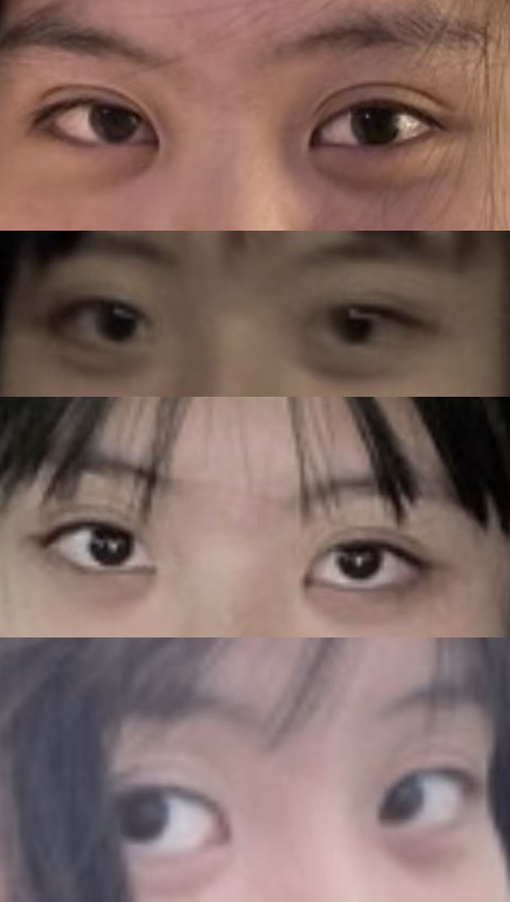

我眼读测试正向满分，我不知道你知不知道。

---

## 一、什么是眼读测试

<small>
“眼读测试”通常是指心理学中著名的 **“眼区读心测试”** (Reading the Mind in the Eyes Test, 简称 **RMET**)。

简单来说，这是一个用来测试情商（特别是共情能力）和“读心”能力的工具。

**1. 它是测什么的？**
它主要测试你的 **“心智理论” (Theory of Mind)** 能力。也就是你能不能仅通过观察别人的眼睛（心灵的窗户），就准确判断出他们当下的情绪、想法或精神状态。

**2. 测试是怎么做的？**
你会看到 36 张黑白照片，每张照片只展示一个人的眼部区域。每张照片旁边有 4 个词，你需要从中选出最符合图中眼神的一个词。

> 作为对高度紧张和过度活跃的神经系统的反应，你的大脑会发展出一种防御机制，通过过度警惕让自己变得几乎“先知先觉”，就像心理学家可以解读一个房间一样。同样的事情也发生在战区的士兵身上。战争的高度紧张会在大脑中触发一个开关，进入过度警惕状态。需要破译尽可能多的信息以确保自身安全。这是 PTSD（创伤后应激障碍）和 CPTSD（复杂性创伤后应激障碍）的前兆。这是一种复杂的恐惧/逃避反应，试图领先于压力。所以，如果你对此有共鸣，很可能你的交感神经系统/战斗、逃跑反应过于活跃。 —— *Reddit*

[传送门：RMET 测试在线地址](https://psytests.org/arc/rmeten.html)
</small>

---

## 二、正文

今天整理了大概七八千张照片。我很讨厌自拍，只是觉得自己长得丑，但我发现我有超级多自拍，应该是聊天里发了然后存下来的。其实我所有的照片都是聊天里发过的。不过七年算下来，这个数量也还好。

实际上也算是预谋已久，从七八月就下决心了。我也没想到自己真的能一张一张照片遍历过去，而且不止一遍。大部分照片里我都在健身房，或者在学校摸猫摸狗。比较高光的时刻是回大理和回家。

总体是平静的，但如果真那么平静，我也不会半夜两点在这里码字玩，说的还絮絮叨叨七扭巴绕。

大概有三四年了吧，我总是在做同样的梦：梦见在古城周围跑，在大丽路坐车，在飞回云南的飞机上，在去大理的高铁上。我一直在路上，然后着急地醒过来。

我记性向来差得离谱，所以我留了很多照片。封面那张是在路上听《旅途愉快》，当时的感觉是幸运。现在还是在听一样的歌。

**旅途愉快。**

本来今天想写《翠湖》的观后感，但想了想发现，居然没有一起去过翠湖闲逛。然后我想找找西湖，结果西湖也没有（如果去吃饭不算在湖边走走的话）。目前为止人生的前半段和后半段。

好像因为东西一下子太多，想说什么又不知道从哪开始。如果从头开始，一句话就说完了：

> **我上一任七年。大家都是很好的人。**

本来昨天晚上和今早还在策划时间点，算来算去算不出，又和尊敬的“万恶之根”女士（朋友）隔着半个地球赛博算命。这里特别鸣谢一下吧，很多我自己都记不清的人，她全帮我记着，并且从一开始就一位都不喜欢。不过我头比较铁，一次都没有听话过。

万幸，我们还是好朋友。

---

### 结语

说了那么多废话，来做个眼读测试吧，算是今天的意外收获，理照片的时候注意到的。

2019 年 6 月 14 号的时候，我坐他腿上说“我喜欢你”。

他说：“早就知道了，眼睛...不一样....（记不得了）。”

这是开头的第一句话。

---

### 谢谢你来看 - 彩蛋

**（歌词片段）**

> 有过你的滋味真的感觉不错
> 除了你的笑没能看过
> 很抱歉从前对你讲的那些话 
> ...
> 我曾想过回过去看一看
> 凭记忆还给你九三年的甜蜜
> 无论如何再抱一个吧
> 想干空气干当时的你