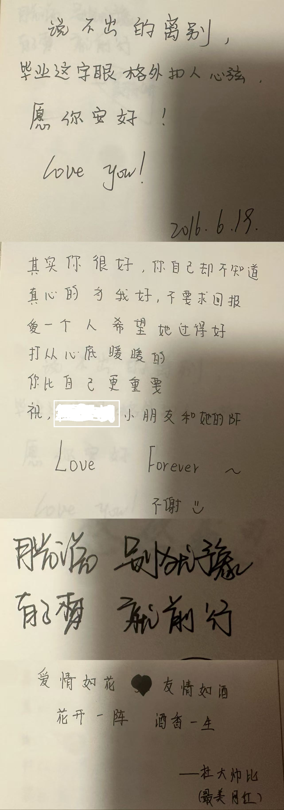

本来blog想改成弄点文献笔记，后来发现文献笔记实在是一种自己收着看看、读过就好的东西。离开杭州的飞机上，看完《猴杯》又开始做梦。最近深睡和眼动时间几乎一样长，一个梦接着一个梦，醒来又忘记大部分。

想要记下来很大一部分原因是昨天回到家，整理书架，添了很多书，翻到以前的笔记本，发现有一页写了很多遍一个人名，并且我对这个人是谁，和我什么关系毫无印象，还在联系的以前就认识的人也不知道他是谁。还有一些十年前的毕业留言，这些人是谁，我毫无印象。留言的内容，我也依然毫无印象。

可能丢掉和弄乱的太多，我记忆里笔记本是小学的，但是内容初高中都有。

离开杭州的有一瞬间，我居然希望我也和忘记高中一样全部忘掉，就一瞬间，然后强烈的舍不得。下一瞬间的想法是我愿意原封不动再把这七年一切狗屁倒灶的日子过千千万万遍，直到所有最小的细节都不会忘记。

每次有人和我说“青春很好”之类的话，我都会回：“青春什么都不是啦，在座哪位更年长的人不是从这时候过来的，人人都有的东西，有什么好享受的。”

但真的毕业的时候，好像没有办法再说出这样的话了。

昨天收拾完所有东西，抱过师妹。师妹说她还不走，要看着我走了再走。然后我也不知道自己是该打车，还是该走路去地铁站，最后坐上了七年里只搭过一次的公交，像在正午梦游。

前夜我在学校闲逛，又去操场、湖边和保研路一个人漫无目的地走。开始怀疑，自己是不是真的有那么喜欢这段生活，还是此刻的怀念和舍不得，有一半来自记忆的美化。

回到家以后，和爷爷奶奶说起读研的事情。

早些时候，挖笋、打火锅、上山下地，中秋节在山顶躺着，室友耳朵进蟑螂去急诊。去年夏天，游野泳、去健身房、骑车、看流星雨、烧烤、吃夜宵。晚归以后更精彩，一月之后直接开始夜不归宿，应该发生在青春期的叛逆和终于当大人了的快乐叠在一起。

每个阶段都是毕业的那个学期玩得最尽兴。

最好玩的时候，都不在教室和实验室。

说完这些高光时刻，才意识到，大部分时间在经历的时候其实都很苦。大部分时候低落，狼狈而且混乱又寂寞。

最近一直刷到有人问：“那我受的委屈算什么？”“那我的痛苦、伤心、难过算什么？”“那我得到的那些对待算什么？”

算体验啊。

为什么非要难过有意义呢。好的坏的，真真实实发生过、存在过，又改变了我的一部分，本身就是意义。怎么能期待用自己主动去吃的苦，和世界要一个自己都说不清楚的答案。

翻日记的时候，发现一个特征，有些知道要结束的生活，在发生的时候就已经开始被我当成回忆事无巨细开始保存。日常沾了告别的光，特别的不日常。

飞机起飞，城市慢慢沉到云层下面，才突然一万分舍不得这个夏天热死冬天冷死终年溽湿雨下不停的地方。

妈还是说着云南人都家乡宝。我不知道是因为我不够纯血，还是别的什么原因，我没有那么想留在这里。我大概高估了自己，以为只要心态够好，就可以从五岁到二十五岁一直沿着同一条路走下去，还保持心态良好。

爸说我大舌头越来越严重了。和麻麻聊天，还有坐地铁的时候，我有时候也会觉得自己像刚化人形，答辩和人讨封，“您看我像人吗？”。

一切都以某种形式留在自己身上。大舌头、平仄，作息，运动，穿衣，常用生活用品，口癖，走路的方式、对地方的亲近和疏离，都会留下来。于是现在也很难再定义自己到底是什么地区的人。好像变得更复杂，也更完整了。

以前总是在等生活开始。

长大就好啦，高考完就好啦，考上研就好啦，毕业工作就好啦。虽然嘴上说着从高考以后就不信了，但心里还是有一坨庞大的、香喷喷的未来在那里馋着人。好像只要离开现在这个阶段，做过的坏事，挨过的骂，神志不清的决定，就都能一笔勾销。

可是有些东西不会因为进入下一阶段就自动消失。前几天被问到，丢掉的记忆究竟是在逃避什么？我还没有确切的答案。我也从来没再问过还联系的高中朋友那时候到底还有什么事情，只聊留下照片我还记得的部分，现在和未来。一堆莫名奇妙的当时认识的人还躺在我列表里，顺走了语文老师的书也在家，各种零碎物品还在继续使用或者陈列，准备带出国，同一家餐厅一个位置从大一坐到研三，毕业前夕还是那么些人。

不知道我有没有变成更好的人，想做一个没那么有用的人。

不过，长大了一点应该是有。等我真的走到青春结束的时候，才有资格说青春的神话到底是不是真的，也不知道“未回答的问题会反复出现，直到被学会”是不是真的。

能抱着这些痕迹继续到处乱跑，保留了记忆的人依然在我生活里，漫长的夏天终于永远不会结束，此刻很满意。

---