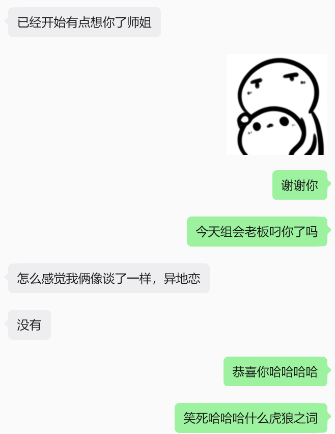

---
想到写这个是送师妹的礼物今天到了，一个可以编辑的墨水屏小挂件，内置赛博掷骰子，答案之书什么的，多少可以让日常内耗的师妹轻松一点，她要什么功能也可以试试看co老师做了给她用。

（btw，师妹大概是喜欢这个礼物的）

稍微熟悉我一些的人，会知道我超爱掷骰子做决定，并且别人问我要不要做什么事，如果察觉到别人明显有答案，我也倾向于问问以后掷骰子。

> 其实这个习惯来源于初中，大家在班上看爱情公寓，大结局的时候，男主要做一个决定，两扇门，一个后面是倒追他美女同事，一个后面是感情线顺了三季要有结果的女主。
> 	"当面对两个选择时，抛硬币总能奏效。并不是因为它总能给出对的答案，而是在你把它抛在空中的那一秒里，你突然就知道，你希望的结果是什么了“。
> 如果抛完还想再来一次，那也知道应该选什么了。

于是就开始抛硬币，并且练的一手漂亮的抛硬币动作，长大会发现有些东西选项不止两个，就改成掷骰子，发现实体麻烦，就开始改发微信骰子。

---

如果什么东西可以算神明，那他的力量就来自信仰，要信仰它，就要和它约定规则（泛灵论暴论），其实说白了心诚则灵，使用的前提相信有命运和无能为力，相信自己是个三维度生物，作出决定的瞬间，未来就会坍缩一部分。尊重和诚实于自己的想法、心情和欲望。

骰子之神当然也有他的规则，我自认为大部分时候我是个非常非常虔诚的人。

以下是一些我多年的使用心得，有一些以前没做到的新增了：
>
>1.丢之前就要想清楚是确定自己心意还是真的要靠随机来帮忙做决定。
>
>2.不可能永远清楚知道自己在想什么，因为很多决定在没想清楚的时候就要做，这样的时候少掷多想。
>
>3.小事可以让随机来做决定。大事只能让骰子帮忙做选择，并且每个选项都要考虑过。更大的事情，不管怎么思考，连一点未来都无法推测的事情，就把未知还给未知，听从骰子的安排。
>
>	小事比如中午沙拉馄饨二选一，看过热量、营养和价格依然无法决定。
>	
>	大事比如选学校专业或者出国去哪，做了不知道多少deepsearch，纠结好几个月，在喜欢和正确里依然无法决定。
>	
>	更大的事就很难说了，大部分时候其实意识不到它正在发生，通常随便丢了一下，忽略了预兆，乐滋滋的做完决定，很久以后才发现是个巨大的蝴蝶效应。
>
>4.不可以用骰子逃避，比如“今天一切合适，没有理由不跑步，让我来想想要不要跑。
>
>5.如果代为问询，永远不要为了自己的愿望，去改变别人的结果。
>
>6.无论是否按照结果行事，不可以把后果或收获给别人。。
>
>**最最重要的，一切决定和行为，都由向骰子询问的人作出。忤逆骰子之神，违背它逼你面对的东西，一定会受到惩罚。**

---

最近发现因为在更大的事里，连续违背骰子，遭老罪报应了。这么说很像谬误归因，实际上就是不带脑做事，在收到应该理性的提示以后还是选了乱来。

其实掷的从来不是骰子，是念头对吧？

好在有这么个仪式以后，比较不容易后悔，现在也更愿意去看到事实而不是保护自己，压缩一个对自己有利的版本来当作总结，多少有点雷霆雨露俱是天恩的意思。总结起一个一个以决定划分的阶段的时候，会觉得经历过本身也很幸福，而且不管在里面有没有开心或者受伤，都会有收获。

比以前有更好的复盘了。

又想起室友毕业前说，来这里读大学是做过最糟糕的决定，什么也没捞着，健康时间情绪精力感情都没了。

我没有办法相信命运会那么苛责一个人的，最次也就拥有的都是侥幸失去的都是人生。

---
最后，不要忤逆骰子，不要忤逆自己的心（我尽量），希望师妹也可以在下一次想要不要去实验室假装上班的时候轻松一点。至于这种事情为什么不问AI，因为发现AI会讨好，会偏袒，会把你自己都没想清楚的事情圆的合情合理，结果后来才发现错的更离谱。

---

