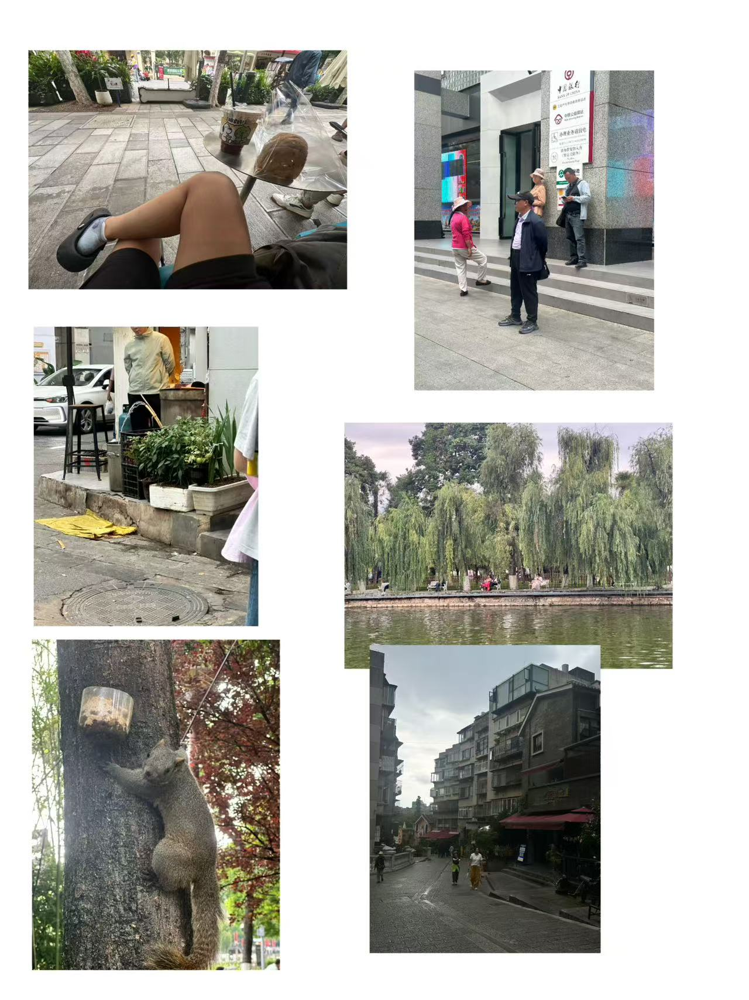
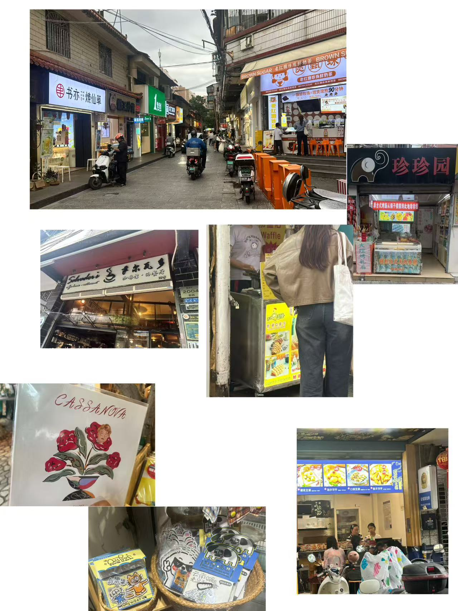
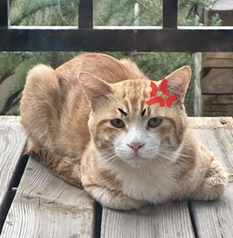
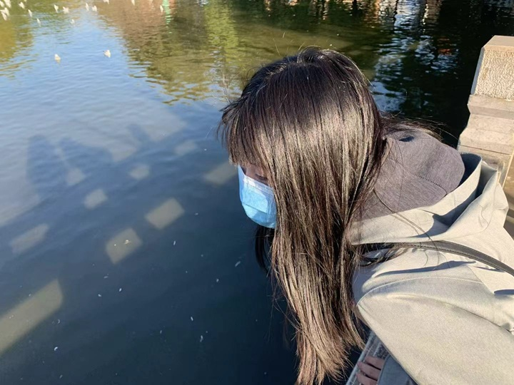

## 前言

六月份的昆明，今天体感温度17，非常适合散步，所以办完事就一个人背着包迷路去了。

实在是个很闲很闲的城市，街上随处可见咖啡店和公共座椅，而工作日依然有大量年轻人坐在咖啡店聊天。最大的发现就是，只要是能坐的地方，就会长坐在路边发呆的人。

接下来背着包在漫无目的地晃，路过景点的话会有人拦住问要不要拍照。翠湖边会有很多很多情侣，很多不限性取向的情侣。

--- 

## 玩什么

商业中心看起来就是杭州上海这种大城市CBD的mini版，但是周围的小巷子和老街区很有逛头。

钻进去，把所有莫名其妙的店摸一遍，会发现最好的小学前门是酒吧街，纹身穿孔古着搞艺术写诗一应俱全。后门是有卖tabasco和奶酪的国际社区，并且卖菜的店兼营唱片，包括《安河桥》和落日飞车，店员会问你要不要听，喜欢他就拿去放，可以坐在店里听。

记忆很好的玩具店老板，可以记住十几年前的学生，虽然最后也会忘掉。

开了很多文创店，非常适合当伴手礼，包括瓦猫、海鸥挂件、狗挂件。

除了瞎溜达，最推荐的玩法是找一个中意的街，然后咖啡馆选门口有露营椅的，就坐在椅子上一杯接一杯喝下去，发呆观看路人，偷听本地人聊天。这里推荐狗面包，狗好好办面包，里面的文创又好看又便宜的像不要钱，后桌聊天说“我不交社保，哪怕我走了，分手了，给我老婆三十万，她还可以花我的钱。”，隔壁三个男生在交流自己男朋友女朋友的问题。景区路边长椅也提供很多纸质书给人看，可以坐在路边看人。

* 这个城市一大魅力就是足够莫名其妙，怪人多到看了就觉得活开心比较重要，其他的没关系，简直莫名其妙。*

* 中国银行门口站满吆喝换美元换外币的大爷大妈，

* 公证处见多识广的工作人员会问女生“那你女朋友不来办吗？”

* 鬼市会有老奶奶卖一包吃的只剩下三片的吐司

* 炒栗子店的员工看着竹管喷水到铁皮桶里看了十分钟

* 宠物店店员乐此不疲的追着狗跑抱出围栏伸到路人脸上。

* 翠湖边的松鼠可以像逗狗一样“嘬嘬嘬”从树上喊下来，你伸手它伸头。

* 皮裙黑丝阿姨会用海绵毛笔在地上写书法，和隔壁不包二奶的书法大爷battle。

* 升学辅导机构兼营作业打印和艺术工作室

* 女卫生间门上刻A片网站

* 卖野生菌那人的路边摊主穿着AJ掰菌玩，见手青氧化会变蓝，就看着他抓一朵，掰一块摩挲摩挲，丢掉，再掰。

* 一群外国人围着翠湖的亲人大白鸭拍照，本地死孩子在一边用面包引诱鸭子。

* 各种垃圾桶、电表箱涂鸦。

---

## 吃什么

首先是各种面包店，狗面包的玫瑰乳扇吐司充满肉感，让人咬一口要停下来盯着吐司想它怎么那么好吃。

其次推荐文林街及文化巷周边，基本上走累了看到什么就吃。

餐厅是萨尔瓦多，什么都好吃，都足以让人吃饱发呆一下午。

文化巷有墙缝里的二十年老店烤香肠，小学生梦中情肠，还有至少十几年的墙缝鸡蛋仔，他们出摊的话就可以吃，烤肠店店员会热心问你哪来的旁边坐。还有辣死人烤豆腐，现在新增了门口露营椅，烤豆腐终于回归到坐路边吃的状况。

各种小摊车食物都是小美味，店铺的话，无论是云南菜还是东南亚，日料西餐，都差不多的异域风情，他们还经常混在一起。

---

## 我抽象完了

外观和气质以及对环境的熟悉程度，我已具备一定外地人特点，装外宾也是很有乐趣哒！甚至比真的在本地生活还要好玩，因为闲闲没事干。

回家以后爹心情激动的展示了天天来睡觉的大猫，并且严厉制止我开门摸猫，大猫看到我就一脸警觉和怨气，我是生人啊。

早年黑长直时期，也是这样一脸好奇的在翠湖梦游。

