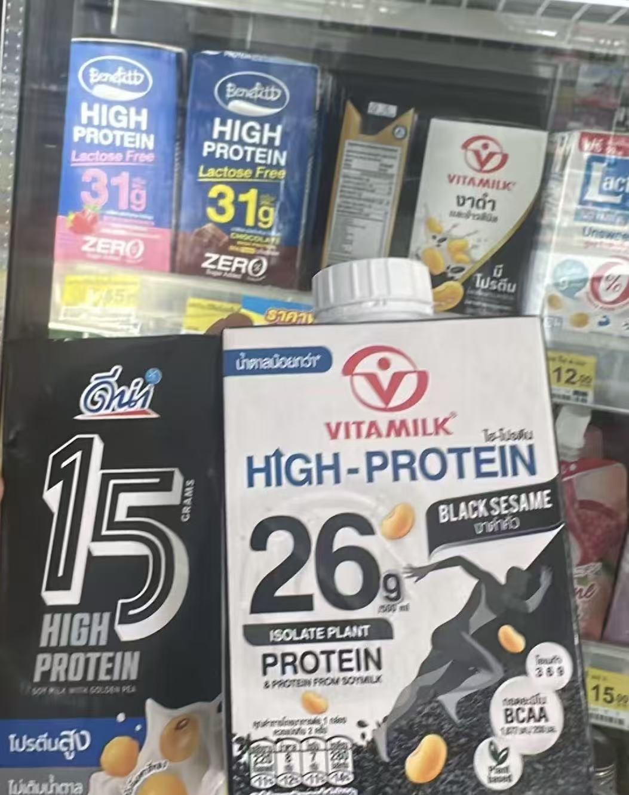

在师妹的介绍下，我认识了我们这栋楼的P，又因为P.姐认识了隔壁化学楼的研究助理K。还有可爱的玩狗认识的小学妹。博士没有倒霉班级的好处就是会认识各种人，顺便学到一点泰语。

并且很开心我的朋友们要到清迈来了！

今天晚上和K哥还有几个他同学一起去看了个live。然后喝苏打水。

从来没想过，我可以用英语聊天，从晚上九点一直聊到十二点。并且只用gpt几次。

我一直觉得自己听力和口语很差，但聊起学术倒霉事和吃科研瓜的时候语言障碍好像完全消失了。我们都不会介意停下来，等对方从自己有限的词汇里慢慢挖出一个最接近那种共同感受的形容词。

最棒的是有些压力以往憋不住了往外说，都只能听到“加油”“你为什么不行”或者“挺辛苦的加油”，第一次听到“I feeling you.”。不用逃避可能延毕，不用绞尽脑汁解释自己在做什么，不用感觉被导师gas lighting还要先证明。

生化环材四大天坑名不虚传。他一个人踩了生、环、材三个坑，有机抗癌材料一做就是十二年，中间还出了场车祸。我当时脑子里只有四个字：吾辈楷模。

虽然大半夜聊课题已经非常奇怪了，但是两个人不知道肌酸和氮泵英语又不想掏手机，猜化学式更离谱。

看得出来，人家是真的很苦。虽然学校里已经十二年，全给学术了还什么都没拿到。政府奖学金的对赌真黑啊，需要去就业意向的行业干满固定年限。

不过听他说完以后，我发现他的导师虽然已经算是极品导师，现在更多的问题是，他要服务整栋楼所有导师，还要顺便当辅导员解决LGBT学生的自我认同困惑。而他说的很多事情，在中国其实已经算是默认规则，而且泰国很少人自杀，一般就辞职，所以多少还是有感觉庆幸又感觉对本地人不公平。不过听说以后也会慢慢变，似乎对外国人留校任教也有很多新的开放。

show me around超开心的。

K也有健身，虽然他说自己不太擅长户外运动，但真的练得很好。他还推荐了我们院楼下的小健身房，便宜到一天大概只要两块钱人民币。

健身房下午四点开门，晚饭前就可以进去练。虽然地方不大，但器械种类非常全。

K原本以为结构快做完了，结果练完腿，结果预测又冒出一堆新的侧链，明天还比我早上工，超可怜的。我们打赌我还可以active超过三个月。

---

还有题外话。

这边真的有好多乳清蛋白可以买。

今天早餐喝了一瓶黑豆豆奶，一瓶就有15克蛋白质，而且只要三块钱人民币。这样的生活还是幸福到正在过的时候都惴惴不安想要付出什么代价，不过本地人真的很喜欢说“Your time is your most precious resource; do what you most want to do，your health and life is most important.”

